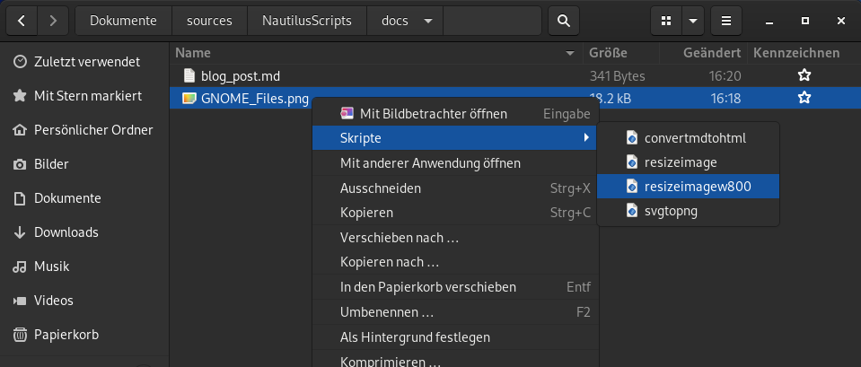
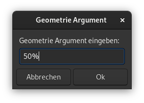

# Gnome Files (Nautilus) durch Skripte erweitern
Ein Nautilus-Skript ist ein ausführbares Shell-Skript, das in einem speziellen Skripte-Verzeichnis abgelegt wird, sodass die grafische Nautilus-Shell es finden kann. Auf diese Weise kann man die Funktionalität des Dateibrowsers erweitern, um so gut wie alles zu tun.


Skripte werden aufgerufen, indem man eine Datei oder eine Gruppe von Dateien auswählt und mit der rechten Maustaste klickt, um das Kontextmenü aufzurufen. Eine der Optionen in diesem Menü ist das Untermenü `Skripte`, mit dem man ein Skript auswählen kann, das auf die ausgewählten Dateien angewendet werden soll.



Das Untermenü `Skripte` erscheint nur, wenn mindestens ein Skript im Skripte-Verzeichnis liegt.

## Skript erstellen
Damit ein Skript von Nautilus gefunden werden kann, muss es sich im Skripte-Verzeichnis `~/.local/share/nautilus/scripts/` befinden. Dieser Ordner befindet sich im Home-Verzeichnis, ist aber standardmässig versteckt. Mit der Tastenkombination `Strg+H` können versteckte Dateien und Ordner in Nautilus angezeigt werden.

Damit Skripte nutzbar sind, müssen sie als ausführbar gekennzeichnet werden. Um ein Skript ausführbar zu machen, klickt man entweder mit der rechten Maustaste auf ein Skript und wählt `Eigenschaften → Zugriffsrechte → Datei als Programm ausführen` oder man verwendet den folgenden Befehl im Terminal:

```
chmod +x name-des-skript
```
Immer wenn ein Skript aufgerufen wird, setzt Nautilus automatisch eine Handvoll Umgebungsvariablen, die man in den Skripten verwenden kann.

* `NAUTILUS_SCRIPT_SELECTED_FILE_PATHS` Zeilenumbruch getrennte Pfade für ausgewählte Dateien (nur wenn lokal) 

* `NAUTILUS_SCRIPT_SELECTED_URIS` Zeilenumbruch getrennte URIs für ausgewählte Dateien 

* `NAUTILUS_SCRIPT_CURRENT_URI` aktueller Speicherort 

* `NAUTILUS_SCRIPT_WINDOW_GEOMETRY` Position und Grösse des aktuellen Fensters 

## Beispiele

### Markdown in HTML konvertieren
Um Markdown Dateien in HTML zu konvertieren benutze ich [pandoc](https://pandoc.org/).

```
#!/bin/bash

while [ $# -gt 0 ]; do
	pandoc "$1" -o "$1"".html"
	shift
done
```
Wenn das Skript in Nautilus ausgeführt wird, wird im selben Verzeichnis eine HTML Datei erstellt.

### Bild skalieren
Um eine Bilddatei zu skalieren verwende ich den Befehl `convert` mit dem Schalter `-resize` von [imagemagick](https://imagemagick.org/index.php). Der Schalter `-resize` benötigt ein [geometrie Argument](https://www.imagemagick.org/script/command-line-processing.php#geometry). Erwähnenswert sind:
* `scale%` Höhe und Breite werden mit angegebenem Prozentsatz skaliert
* `width` Breite vorgegeben, Höhe wird automatisch berechnet, um das Seitenverhältnis zu erhalten
* `widthxheight` Maximale Werte von Höhe und Breite, Seitenverhältnis wird beibehalten

Um das Skript vielseitig zu verwenden, habe ich eine grafische Eingabe mit [Zenity](https://de.wikipedia.org/wiki/Zenity) erstellt, um das `geometrie Argument` zu übergeben.



```
#!/bin/bash

SIZE=$(zenity --entry --title="Geometrie Argument" --text="Geometrie Argument eingeben:")

while [ $# -gt 0 ]; do
	convert "$1" -resize $SIZE "$1"
	shift
done
```
### Weitere Beispiele
Weitere Beispiele sind im Projekt auf GitHub [https://github.com/MrReSc/NautilusScripts](https://github.com/MrReSc/NautilusScripts) verfügbar.

